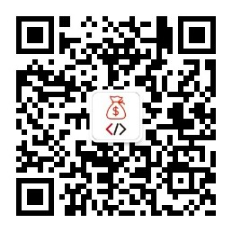

## 简介
你好，我是老火，一个创业3年+的程序员，喜欢折腾，不言放弃，从2020全职创业至今，跑过外卖，摆过地摊，运营过各种互联网项目，开过公司，做过生意，无一幸免，全部失败，验证了那句话，干啥黄啥，生活总是充满了跌宕起伏，时而如山间清晨的飞鸟，时而如暴风雨中的狂澜，一路走来，久经沧桑，起起落落，自己一直做的就是互联网，所以有了这个想法，想做个一个程序员副业的项目，由此有了这个仓库。

我干程序员整整八年多了，这一路走来，看透了很多事，尤其是随着年龄大了，越来越焦虑，尤其是在行情不好的情况下，看不到前景，因为程序员是吃青春饭的，你时不时会有以下或者遇到以下的问题：

1.焦虑  
2.压力  
3.迷茫

每天晚上都好焦虑，不想上班，不自由，上班来钱太慢了，干着自己不喜欢的事，每天跟不喜欢的人打交道好费劲，上班看不到未来，职场关系好难处理，付出和收获不成正比等等，不想上班的理由有一万个，而上班的理由就一个，搞钱，没钱生活都困难，搞钱的路子千千万万，如果有一个副业一个月能给我，带来几千到几万的收入，那不锦上添花，万一那一天副业做大了，能自己出来单干了，做大做强，这种事又不是没有，而我要做的就是这么一件事，提供程序员能做的各种副业案例，为你创收，早点实现财务自由，走上人生巅峰。

该仓库主要是收录整理适合程序员操作的项目以及思路，程序员最不缺的就是技术，缺的是一个变现的思路，在技术+思路的加持下，赚点小钱一点都不难，所以可以把该仓库当做自己开眼的案例库。

## 内容
内容发布到公众号，按期更新，更新周期为每天或每周更新一篇，获得更好的阅读体验，可以关注以下公众号查看

